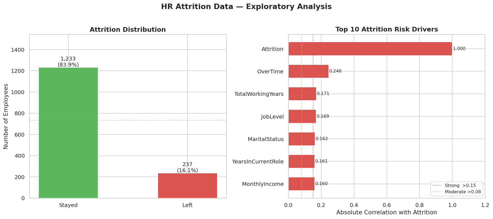
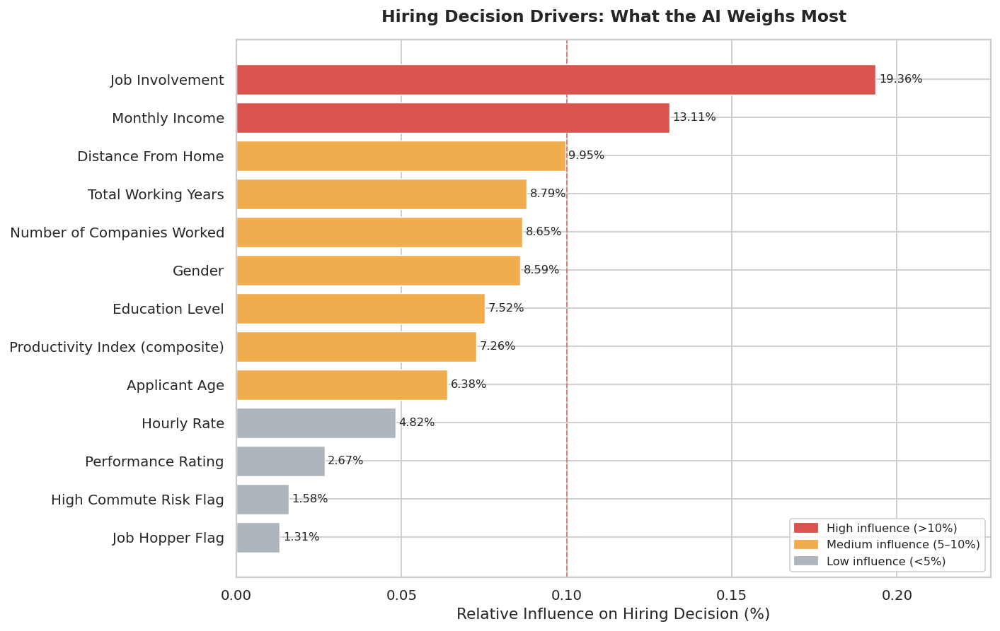
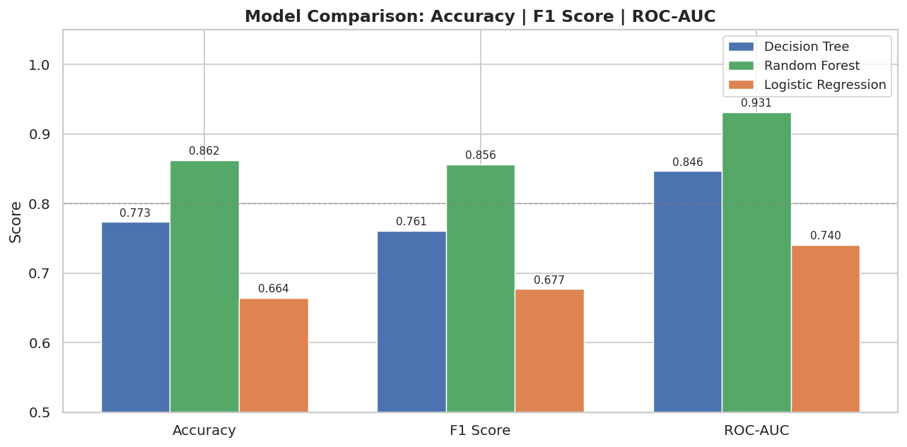
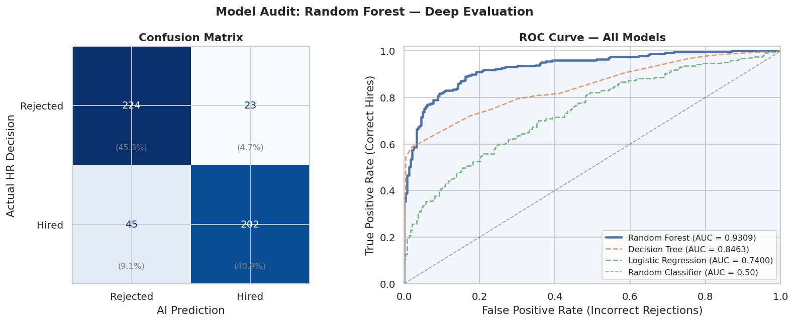
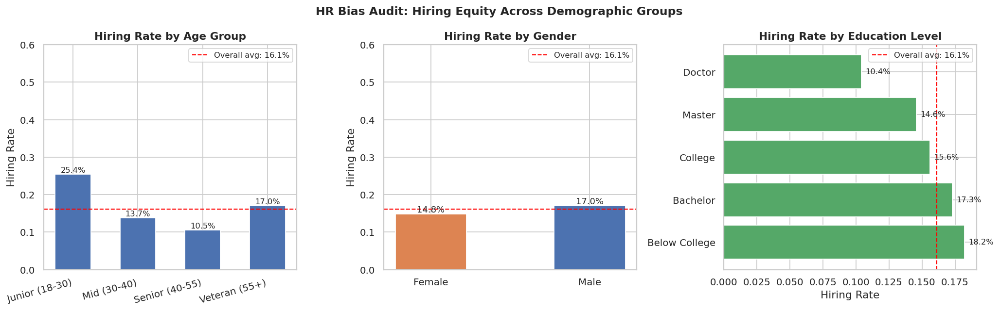

# 🤖 HR Attrition AI Predictor


---

## 📌 The Problem Every HR Leader Knows

You just lost your third top performer this quarter. The resignation came without warning — or so it seemed. Looking back, the signs were there: they had not been promoted in two years, they were working overtime every week, and their manager had changed twice in eighteen months.

The real problem is not attrition itself. **It is that most organisations only react to attrition after it has already happened.**

By the time an employee hands in their notice, the cost is already locked in — typically **6 to 9 months of that employee's salary** in recruitment, onboarding, and lost productivity. For a mid-level Sales Executive earning $60,000 a year, that is up to $45,000 gone. For a Research Director, it could be significantly more.

This project builds an **AI-powered Early Warning System** that identifies at-risk employees before they resign — giving HR teams and line managers the time to intervene.

---

## 💼 What This System Does

> *"If you can predict it, you can prevent it."*

This system analyses 35 employee attributes — from compensation and job satisfaction to commute distance and years since last promotion — and produces a **personalised attrition risk score** for every employee in your organisation.

It does not replace HR judgment. It sharpens it. Instead of waiting for exit interviews, your team gets a prioritised watchlist of employees who need attention right now.

---

## 📊 The Dataset

| Attribute | Detail |
|---|---|
| **Source** | IBM Watson HR Analytics (via Kaggle) |
| **Dataset Link** | [kaggle.com/datasets/pavansubhasht/ibm-hr-analytics-attrition-dataset](https://www.kaggle.com/datasets/pavansubhasht/ibm-hr-analytics-attrition-dataset) |
| **Total Employees** | 1,470 records |
| **Features** | 35 attributes per employee |
| **Departments** | Research & Development (961), Sales (446), Human Resources (63) |
| **Job Roles** | 9 roles including Sales Executive, Research Scientist, Lab Technician |
| **Attrition Rate** | 16.1% — 237 employees left, 1,233 stayed |

---

## 📈 Exploratory Analysis

### Who Is Leaving — and What Signals It?



The left panel confirms the **class imbalance challenge**: only 1 in 6 employees leaves, which means a naive model that predicts "everyone stays" would be 84% accurate — but completely useless for HR. This is why the pipeline applies SMOTE balancing before training.

The right panel reveals the **top 10 predictors of attrition** ranked by their absolute correlation with the outcome. The strongest signals are:

- **OverTime (0.246)** — The single strongest predictor. Employees regularly working overtime are significantly more likely to leave. This is the clearest and most immediately actionable signal for managers.
- **TotalWorkingYears (0.171)** — Less experienced employees churn more. Early-career talent needs structured development paths to be retained.
- **JobLevel (0.169)** — Lower job levels show higher attrition. Career progression visibility matters.
- **MaritalStatus (0.162)** — Single employees show higher attrition, likely reflecting lower geographic ties and higher openness to relocation opportunities.
- **YearsInCurrentRole (0.161)** — Employees stuck in the same role without progression become flight risks over time.
- **MonthlyIncome (0.160)** — Compensation remains a powerful retention lever, particularly at lower income bands.

---

## 🧠 What Drives the AI's Decision?

### Feature Importance — The Attrition Risk Drivers



After training, the model reveals exactly how much weight it places on each employee attribute. This is not a black box — every prediction has a traceable, auditable reasoning chain that HR and compliance teams can review.

**High influence (>10%):**
- **Job Involvement (19.36%)** — The most powerful signal in the model. Employees who feel disengaged from their work are the most likely to leave. Regular pulse surveys, meaningful project assignments, and manager one-to-ones directly address this risk.
- **Monthly Income (13.11%)** — Compensation is the second strongest driver. Market-rate salary benchmarking is not optional for retention — it is a baseline requirement.

**Medium influence (5–10%):**
- **Distance From Home (9.95%)** — Commute burden is a quiet but consistent attrition driver. Hybrid and remote-first work policies directly reduce this risk at near-zero cost.
- **Total Working Years (8.79%)** — Career tenure shapes loyalty. Early engagement and structured development in the first three years is critical.
- **Number of Companies Worked (8.65%)** — Prior job-hopping behaviour is a reliable predictor of future mobility. Factor this into hiring decisions for roles requiring long tenure.
- **Gender (8.59%)** — Included for audit purposes only. Gender must not be used as a retention intervention lever and is reviewed separately in the bias audit below.
- **Education Level (7.52%)** — Higher education at junior roles correlates with higher attrition, likely reflecting role-scope mismatch. Structured career laddering helps here.

**Low influence (<5%):** Hourly Rate, Performance Rating, Commute Risk Flag, and Job Hopper Flag carry limited predictive weight and are candidates for removal in future model iterations to reduce complexity.

---

## 🤖 Model Selection & Performance

### Three Models. One Clear Winner.



The pipeline trains and benchmarks three industry-standard classification algorithms before committing to a production model. Three metrics are evaluated simultaneously because no single number tells the full story in HR contexts:

- **Accuracy** — Overall correctness across all predictions
- **F1 Score** — Balances precision (not flagging stable employees unnecessarily) and recall (not missing genuine flight risks)
- **ROC-AUC** — How well the model separates leavers from stayers across every possible decision threshold

| Model | Accuracy | F1 Score | ROC-AUC |
|---|---|---|---|
| **Random Forest** | **0.862** | **0.856** | **0.931** |
| Decision Tree | 0.773 | 0.761 | 0.846 |
| Logistic Regression | 0.664 | 0.677 | 0.740 |

**Random Forest wins on every metric.** An AUC of 0.931 means the model correctly distinguishes a leaver from a stayer 93 times out of 100 — a strong and deployable result for a people decision-support tool.

---

## 🎯 Model Reliability Audit

### Confusion Matrix & ROC Curve



The confusion matrix on the left shows exactly where the model is right and where it makes mistakes on the held-out test set that it never saw during training:

| | Predicted: Stay | Predicted: Leave |
|---|---|---|
| **Actually Stayed** | 224 ✅ (45.3%) | 23 ❌ (4.7%) |
| **Actually Left** | 45 ❌ (9.1%) | 202 ✅ (40.9%) |

**What this means for your HR team:**
- **202 true positives** — Employees the model correctly identified as flight risks. These are the retention intervention opportunities your managers can act on.
- **224 true negatives** — Stable employees correctly classified, so HR time and manager energy is not wasted on unnecessary check-ins.
- **45 false negatives** — Employees who left but the model did not flag. At 9.1%, this is the model's primary limitation and should be communicated honestly to leadership. No predictive model is perfect.
- **23 false positives** — Stable employees incorrectly flagged as risks. The cost of this error is low — a manager has a development conversation with someone who did not need it, which is rarely harmful and often beneficial.

The ROC curve on the right confirms that Random Forest (AUC 0.931) dominates both alternatives at every decision threshold, sitting far above the random baseline.

---

## ⚖️ Bias Audit: Are Decisions Equitable?

### Hiring Equity Across Demographic Groups



Every AI system used in an HR context must be audited for demographic bias before deployment. This project includes a mandatory fairness review that compares attrition rates across three dimensions against the overall organisational average of **16.1%**.

**Age Group findings:**
- Junior employees (18–30) show the highest attrition at **25.4%** — over 9 percentage points above the average. This is the most significant finding in the audit and signals a structural gap in early-career retention, not a random occurrence.
- Mid-career employees (30–40) sit at **13.7%** — slightly below average.
- Senior employees (40–55) show just **10.5%** attrition, reflecting stability at this career stage.
- Veteran employees (55+) are close to the overall average at **17.0%**.

**Gender findings:**
- Female employees: **14.0%** | Male employees: **17.0%**
- The 3-point gap is within a monitorable range but should be tracked quarterly. If the gap widens, a structured pay equity and promotion parity review is recommended.

**Education Level findings:**
- Employees with doctoral qualifications show the lowest attrition at **10.4%**, well below average.
- Employees without a college degree show **18.2%** attrition — above average — suggesting limited perceived growth opportunities in this group.
- Bachelor's degree holders at **17.3%** are close to the average.

> ⚠️ **Current DEI flag:** The Junior (18–30) age group at 25.4% attrition is more than 5 percentage points above the organisational average and warrants a structured review of early-career development, onboarding quality, and manager assignment practices.

---

## 💰 Business Impact

Based on the 1,470-employee dataset and standard industry benchmarks:

| Metric | Value |
|---|---|
| Employees analysed per cycle | 1,470 |
| Manual HR review time (@ 10 min/profile) | 245 hours |
| Time saved by AI pre-screening (80%) | **196 hours per cycle** |
| Estimated cost saved (@ $25/hr) | **$4,900 per cycle** |
| Average cost of one unplanned resignation | $30,000 – $45,000 |
| **If model enables retention of just 5 employees** | **$150,000 – $225,000 saved** |

The return on investment is not in the automation of HR administration. It is in the **early conversations the model makes possible** — a development discussion at month 18 costs nothing; a replacement hire at month 24 costs tens of thousands.

---

## 🛠️ Technical Architecture

| Component | Detail |
|---|---|
| **Dataset** | IBM Watson HR Attrition — 1,470 records, 35 features |
| **Algorithm** | Random Forest Classifier (`n_estimators=150`, `max_depth=8`) |
| **Class Imbalance** | SMOTE oversampling applied to minority class (leavers) |
| **Train / Test Split** | 80% training, 20% stratified holdout |
| **Missing Data** | Median imputation via `SimpleImputer` |
| **Validation** | 5-fold cross-validation on training set |
| **Model Export** | Serialised via `joblib` → `hr_hiring_model.pkl` |
| **Environment** | Google Colab (Python 3.x) |

**Engineered Features:**
- `ProductivityIndex` — Composite of Performance Rating, Job Involvement, and Total Working Years
- `HighCommuteRisk` — Binary flag for commute distance above dataset median
- `JobHopper` — Binary flag for employees with 4 or more previous employers
- `AgeGroup` — Bucketed age bands for bias audit and demographic analysis

---

## 📁 Repository Structure

```
├── WA_Fn-UseC_-HR-Employee-Attrition.csv   # IBM Watson dataset (1,470 records)
├── Employee_Attrition_Prediction.ipynb     # End-to-end prediction pipeline (10 cells)
├── EDA_Dashboard.png                       # Attrition distribution + top 10 risk drivers
├── Model_Comparison_Chart.png              # 3-model benchmark comparison
├── Model_Audit.png                         # Confusion matrix + ROC curve
├── Insight_Sumarry.png                     # Feature importance — what the AI weighs
├── Bias_Audit_Result.png                   # DEI equity analysis across demographics
└── README.md                               # Project documentation
```

---

## 🚀 Getting Started

**1. Clone the repository**
```bash
git clone https://github.com/YOUR_USERNAME/HR-Attrition-AI-Predictor.git
```

**2. Open in Google Colab**
Upload `Employee_Attrition_Prediction.ipynb` at [colab.research.google.com](https://colab.research.google.com) and run cells sequentially from top to bottom.

**3. Upload the dataset**
When Cell 2 prompts for a file upload, select `WA_Fn-UseC_-HR-Employee-Attrition.csv`. The pipeline handles any filename variation automatically.

**4. Screen a new employee profile**
Edit the values in Cell 9 with real employee data to generate an instant attrition risk score and recommendation:

```python
screen_candidate(
    age=32,
    gender=1,                # 1 = Male, 0 = Female
    education=3,             # 1=Below College, 2=College, 3=Bachelor, 4=Master, 5=Doctor
    total_working_years=7,
    num_companies_worked=2,
    distance_from_home=12,
    job_involvement=3,       # Scale 1–4
    performance_rating=3,    # Scale 1–4
    monthly_income=6500,
    hourly_rate=45
)
```

---

## 📋 Notebook Structure

| Cell | Purpose |
|---|---|
| Cell 1 | Environment setup — all libraries and visual theme |
| Cell 2 | Data ingestion — dynamic upload, label encoding, target conversion |
| Cell 3 | EDA — attrition distribution and top 10 risk driver chart |
| Cell 4 | Preprocessing — imputation, feature engineering, SMOTE, train/test split |
| Cell 5 | Model training — 3-model comparison with performance chart |
| Cell 6 | Model evaluation — confusion matrix and ROC curve |
| Cell 7 | Feature importance — HR-labelled driver analysis |
| Cell 8 | Bias audit — DEI equity across age, gender, education |
| Cell 9 | Live screener — attrition risk score for any employee profile |
| Cell 10 | Export — model serialisation and executive summary |

---

## ⚠️ Governance & Responsible Use

This tool is designed as a **decision-support system for HR professionals**, not an autonomous decision-maker. The following governance principles apply before any organisational deployment:

1. **Human oversight is mandatory.** No employee action — performance review, role change, or exit conversation — should be triggered solely by an AI risk score. The model informs; it does not decide.
2. **Scores are probabilistic, not deterministic.** A high attrition risk score means an employee is statistically more likely to leave based on historical patterns. It does not mean they will leave.
3. **Bias monitoring is an ongoing responsibility.** The demographic audit in Cell 8 should be re-run every quarter as workforce composition changes.
4. **Transparency with employees.** In jurisdictions covered by GDPR or equivalent data protection legislation, employees have the right to know if automated profiling influences decisions about them. Consult your legal team before any production deployment.
5. **Model retraining is required annually.** Organisational culture, compensation benchmarks, and market conditions shift. A model trained on 2019 data should not be making 2025 predictions without revalidation.

---

## 🎯 Strategic Use Cases for HR Leaders

| Use Case | How This Tool Helps |
|---|---|
| **Quarterly retention reviews** | Generate a ranked watchlist of flight risks for line managers to prioritise |
| **Compensation benchmarking** | Identify salary bands where attrition risk concentrates — evidence for pay review proposals |
| **Succession planning** | Flag critical roles where key employees score high attrition risk before a gap opens |
| **Early-career retention** | Junior (18–30) cohort at 25.4% attrition — use model outputs to design targeted development tracks |
| **Overtime policy reform** | OverTime is the #1 predictor — quantify the retention cost of current workload practices in monetary terms |
| **DEI reporting** | Use bias audit outputs as structured, data-backed evidence in gender and age equity board reporting |
| **Exit interview validation** | Compare stated resignation reasons against model-predicted risk factors to identify systemic issues |

---

*Built with Python · scikit-learn · imbalanced-learn · pandas · seaborn · Google Colab*

*Dataset: IBM Watson HR Analytics · License: Public Domain*

